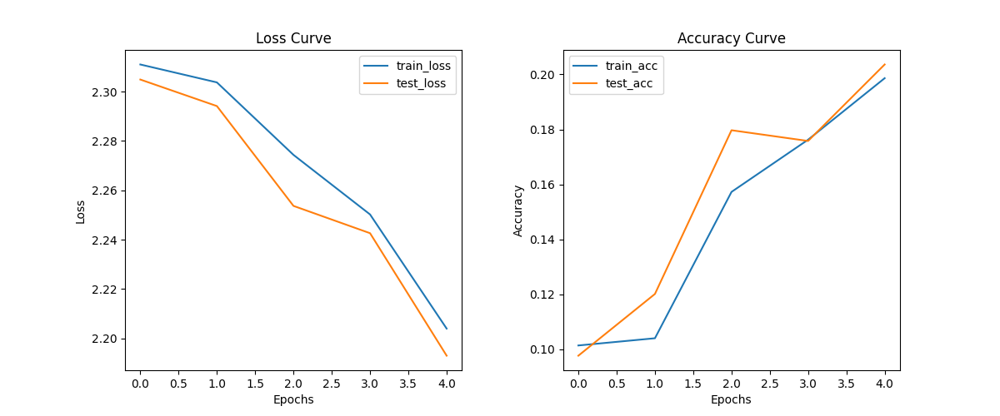
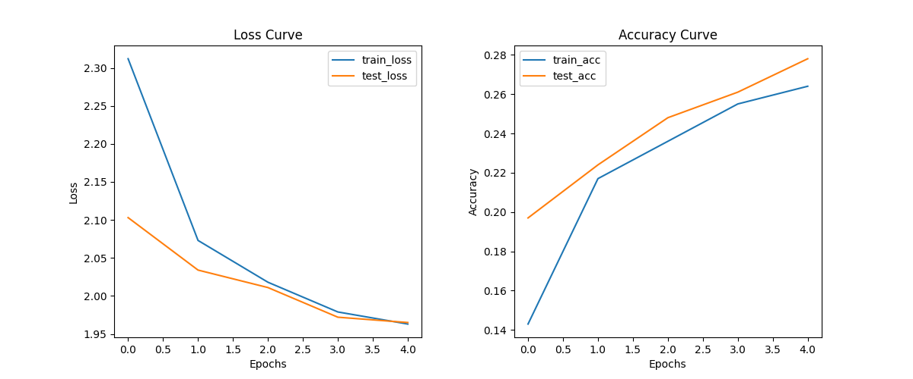
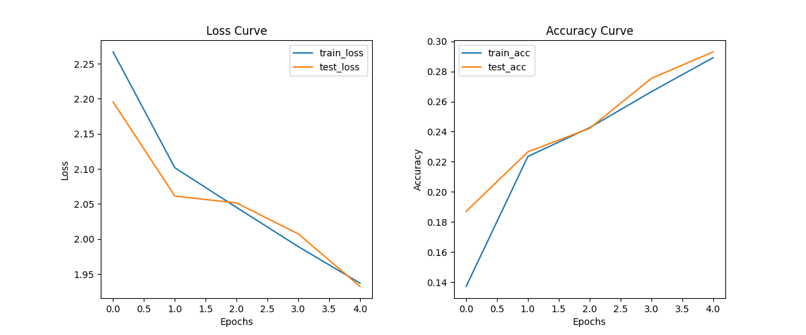

# Computer Vision - Deep Learning on Food101
Convolutional Neural Network Models using pytorch 

In this report, the results of the experiments using three different categories of neural
networks on the Food101 dataset: a basic CNN, an all-convolutional net, and a model
with regularization, are shown. I used Vanilla PyTorch for implementing the models and
trained them for up to 5 epochs. Tqdm was
used to display the progress as the model was being trained. After each epoch, training
and test loss, as well as training and test accuracies, were reported.


All the training was done using the following global parameters:
`````
NUM_EPOCHS = 5
BATCH_SIZE = 64
LEARNING_RATE = 0.001
HIDDEN_LAYER_SIZE = 101
`````

## Dependencies
`````
torchvision
pytorch
tqdm
`````

## Models & Dataset Used
The dataset used in this project is the Food-101 dataset, which can be found [here](https://data.vision.ee.ethz.ch/cvl/datasets_extra/food-101/). The dataset is split into a training set and a test set. The training set consists of 75,750 images, while the test set has 25,250 images. Each class has 1,000 images, with 750 used for training and 250 used for testing.

The following models were tested:

- Basic CNN (ConvFC)
- All Convolutional Net
- Basic CNN with Regularization (Data Augmentation)
- Transfer Learning (ResNet-34)


## BasicCNN
The given model, ConvFC, consists of two main blocks: a convolutional block and a fully
connected block.
1. The convolutional block (conv_block_1) includes the following layers:
- Conv2D layer with 3 input channels, 8 output channels, a kernel size of (3, 3), stride
(1, 1), and padding (1, 1).
- ReLU activation function.
- Conv2D layer with 8 input channels, 16 output channels, a kernel size of (3, 3),
stride (1, 1), and padding (1, 1).
- ReLU activation function.
- MaxPool2d layer with a kernel size of 2 and stride of 2.
- Conv2D layer with 16 input channels, 32 output channels, a kernel size of (3, 3),
stride (1, 1), and padding (1, 1).
- ReLU activation function.
- Conv2D layer with 32 input channels, 64 output channels, a kernel size of (3, 3),
stride (1, 1), and padding (1, 1).
- ReLU activation function.
- MaxPool2d layer with a kernel size of 2 and stride of 2.
2. The fully connected block (fc_block) includes the following layers:
- Flatten layer, which flattens the input tensor along dimensions 1 to -1.
- Linear layer with 16,384 input features and 101 output features.
- ReLU activation function.
- Linear layer with 101 input features and 101 output features.
- ReLU activation function.
- Linear layer with 101 input features and 101 output features.
- ReLU activation function.
- Linear layer with 101 input features and 101 output features.

### Results:


## AllCNN

The architecture is defined by the following two blocks:

1. The convolutional block (conv_block_1) includes the following layers:
- Conv2D layer with 3 input channels, 8 output channels, a kernel size of (3, 3),
stride (1, 1), and padding (1, 1).
- ReLU activation function.
- Conv2D layer with 8 input channels, 16 output channels, a kernel size of (3, 3),
stride (1, 1), and padding (1, 1).
- ReLU activation function.
- MaxPool2d layer with a kernel size of 2 and stride of 2.
- Conv2D layer with 16 input channels, 32 output channels, a kernel size of (3, 3),
stride (1, 1), and padding (1, 1).
- ReLU activation function.
- Conv2D layer with 32 input channels, 64 output channels, a kernel size of (3, 3),
stride (1, 1), and padding (1, 1).
- ReLU activation function.
- MaxPool2d layer with a kernel size of 2 and stride of 2.
- Conv2D layer with 64 input channels, 101 output channels, a kernel size of (3, 3),
stride (1, 1), and padding (1, 1).
- ReLU activation function.
- Conv2D layer with 101 input channels, 101 output channels, a kernel size of (3,
3), stride (1, 1), and padding (1, 1).
- ReLU activation function.
- MaxPool2d layer with a kernel size of 2 and stride of 2.
- Conv2D layer with 101 input channels, 101 output channels, a kernel size of (3,
3), stride (1, 1), and padding (1, 1).
- ReLU activation function.
- Conv2D layer with 101 input channels, 101 output channels, a kernel size of (3,
3), stride (1, 1), and padding (1, 1).
- ReLU activation function.
- MaxPool2d layer with a kernel size of 2 and stride of 2.
2. The classifier block includes the following layers:
- Flatten layer, which flattens the input tensor along dimensions 1 to -1.
- Linear layer with 1,616 input features and 101 output features

### Results:


## Regularization
For regularization, I added data augmentation in the form of random horizontal flips and
random rotations to the basic CNN model. The data augmentation transform is as
follows:
1. Random horizontal flip with a probability of 0.5
2. Random rotation by 30 degrees with a probability of 0.25

The flip and rotation help with the model not learning the orientation of the food. This
way the food can be any orientation.


### Before Data Augmentation: 


### After Data Augmentation: 


We see that the final loss is less with the augmentation and the accuracy also improves keeping
the other hyperparameters the same.
Accuracy jumps from `````0.216````` to `````0.297`````
Final Model Accuracy: `````29.7%`````

## Transfer Learning
For transfer learning, I used the Resnet 34 model for this task due to its excellent balance
between accuracy and computational efficiency. ResNet-34 has 34 layers, with 3 fully connected
and 31 convolutional layers in residual blocks. Its moderate depth provides a balance between
performance and computational cost, making it suitable for the Food101 dataset, as it learns
complex features efficiently.

The pretrained and fine-tuned results are as follows:


Final Model Accuracy: `````65.1%`````

## Contact
If you have any questions or feedback, please feel free to contact the author.


## Copyright 

Copyright © 2023. All rights reserved.

This software is provided for educational purposes only. It is prohibited to use this Portable Index-Allocated File System, for any college assignment or personal use. Unauthorized distribution, modification or commercial usage is strictly forbidden. Please respect the rights of the author.
